# 5-Stage Pipelined RV32I Processor with Dynamic Hazard Resolution

A 32-bit RISC-V (RV32I) CPU core built from scratch in SystemVerilog — Harvard-style split memory, a full 5-stage pipeline, and a hardware Hazard Unit that resolves Read-After-Write dependencies through forwarding, with zero stalls and zero software-inserted NOPs.

[](https://riscv.org/)

[](http://iverilog.icarus.com/)
[](http://gtkwave.sourceforge.net/)

</div>

---

## Overview

This repository implements a **32-bit, 5-stage pipelined processor** for the RV32I instruction set — Fetch, Decode, Execute, Memory, Writeback — designed and verified from the ground up in SystemVerilog.

Pipelining pushes instruction throughput toward the theoretical ideal of **CPI ≈ 1.0**, but overlapping instruction execution introduces hazards. This design handles both classes head-on:

- **Structural hazards** — eliminated entirely via a **Harvard-style split memory** architecture (separate instruction and data memory).
- **Data hazards (RAW)** — resolved **dynamically in hardware** via a dedicated **Hazard Unit** that forwards computed results from the `EX/MEM` and `MEM/WB` pipeline boundaries straight back into the ALU — no stalls, no compiler-inserted NOPs.

Every stage was built and verified **independently first** (its own module, its own components, its own testbench, its own GTKWave capture) before being consolidated into the final integrated `pipeline_top` design — which is exactly how this repo is organized.

---
### Comprehensive Report
For a deep dive into the RTL design choices, hazard unit logic, and module-by-module verification methodology, read the full project paper: [RV32I Architecture and Verification Report](./RISC-V_5stage_Pipeline_Report.pdf).

---

### Architecture Block Diagram


---

## Key Features

| Feature | Description |
|---|---|
| **5-Stage Pipeline** | IF → ID → EX → MEM → WB, fully pipelined control and data signals |
| **Harvard Architecture** | Separate instruction & data memories — no structural hazards |
| **All Six RV32I Formats** | R, I, S, B, U, and J-type decode support |
| **Module-by-Module Verification** | Every stage independently testbenched *and* proven again at full top-level integration |

---

## Architecture

### Pipeline Stages

| Stage | Responsibility |
|---|---|
| **IF** – Instruction Fetch | PC register, PC+4 adder, instruction memory read, branch-target mux |
| **ID** – Instruction Decode | Instruction slicing, Control Unit, Register File read, immediate sign-extension |
| **EX** – Execute | ALU computation, branch target address, forwarding muxes (`ForwardAE` / `ForwardBE`) |
| **MEM** – Memory Access | Load/store to Data Memory via `ALUResultM` address |
| **WB** – Writeback | Result mux (ALU / memory / PC+4) written back to the Register File and forwarded to EX |

### Hazard Unit — Forwarding Logic

The Hazard Unit compares the destination registers of in-flight instructions in `MEM` and `WB` against the source registers required in `EX`:

```verilog
if (RegWriteM && (RdM != 0) && (RdM == Rs1E)) ForwardAE = 2'b10;  // EX/MEM forward
if (RegWriteW && (RdW != 0) && (RdW == Rs1E)) ForwardAE = 2'b01;  // MEM/WB forward
// mirrored for ForwardBE / Rs2E
// default: ForwardAE / ForwardBE = 2'b00  -> use register file output
```

This lets a dependent instruction (e.g. `sub s2, s8, s3` right after `add s8, s4, s5`) get the correct operand the *same cycle* it needs it — no NOP insertion required.

---

## Top-Level System Verification (`pipeline_top`)
This section demonstrates the fully integrated 5-stage pipeline executing `memfile.hex`. The assembly program forces back-to-back Read-After-Write (RAW) data hazards to stress-test the forwarding logic end-to-end.

### Terminal Execution Log
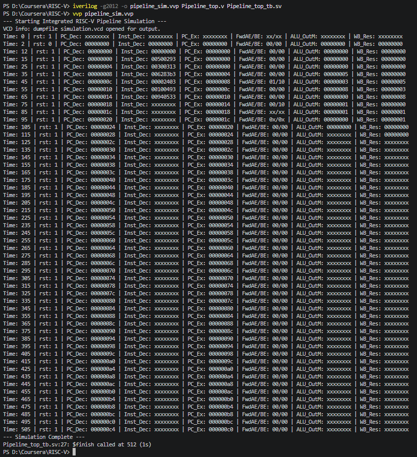

### Full Pipeline Simulation Waveform
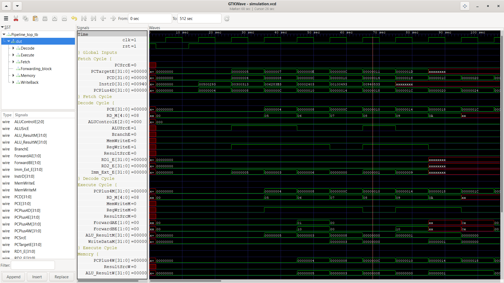

---

## Instruction Formats Supported

| Format | Usage | Layout |
|---|---|---|
| **R-Type** | Register-register ALU ops | `funct7, rs2, rs1, funct3, rd, opcode` |
| **I-Type** | Immediate arithmetic, loads | `imm[11:0], rs1, funct3, rd, opcode` |
| **S-Type** | Stores | `imm[11:5], rs2, rs1, funct3, imm[4:0], opcode` |
| **B-Type** | Conditional branches | `imm[12\|10:5], rs2, rs1, funct3, imm[4:1\|11], opcode` |
| **U-Type** | Upper immediate loads | `imm[31:12], rd, opcode` |
| **J-Type** | Unconditional jumps | `imm[20\|10:1\|11\|19:12], rd, opcode` |

---

## Repository Structure

```
.
├── decode_cycle/
│   ├── components_decode_cycle.v
│   ├── decode_cycle.v
│   ├── decode_cycle_GTKWave_simulation.png
│   ├── decode_cycle_tb.sv
│   └── decode_cycle_terminal_output.png
├── execute_cycle/
│   ├── components_execute_cycle.v
│   ├── execute_cycle.v
│   ├── execute_cycle_GTKWave_simulation.png
│   ├── execute_cycle_tb.sv
│   └── execute_cycle_terminal_output.png
├── fetch_cycle/
│   ├── components_fetch_cycle.v
│   ├── fetch_cycle.v
│   ├── fetch_cycle_GTKWave_simulation.png
│   ├── fetch_cycle_tb.sv
│   └── fetch_cycle_terminal_output.png
├── hazard_unit/
│   ├── components_hazard_unit.v
│   ├── hazard_unit.v
│   ├── hazard_unit_GTKWave_simulation.png
│   ├── hazard_unit_tb.sv
│   └── hazard_unit_terminal_output.png
├── memory_cycle/
│   ├── components_memory_cycle.v
│   ├── memory_cycle.v
│   ├── memory_cycle_GTKWave_simulation.png
│   ├── memory_cycle_tb.sv
│   └── memory_cycle_terminal_output.png
├── pipeline_top/
│   ├── Pipeline_top.v
│   ├── Pipeline_top_tb.sv
│   ├── components_combined.v
│   ├── memfile.hex                        # assembled with the Venus RISC-V simulator
│   ├── pipeline_top_GTKWave_simulation.png
│   └── pipeline_top_terminal_output.png
├── writeback_cycle/
│   ├── components_writeback_cycle.v
│   ├── writeback_cycle.v
│   ├── writeback_cycle_GTKWave_simulation.png
│   ├── writeback_cycle_tb.sv
│   └── writeback_cycle_terminal_output.png
└── README.md
```

> **Design pattern:** each stage folder carries its own local `components_*.v` (ALU, register file, control unit, etc.) so it could be testbenched completely in isolation. `pipeline_top/components_combined.v` consolidates all of those into the single shared set used by the final integrated design.

---

## Getting Started

### Prerequisites

- [Icarus Verilog](http://iverilog.icarus.com/) (`iverilog`, `vvp`) — SystemVerilog-2012 support
- [GTKWave](http://gtkwave.sourceforge.net/) — waveform viewer

### Running an Individual Stage

Each stage folder is self-contained. For example, to re-run the Execute stage:

```bash
cd execute_cycle
iverilog -g2012 -o sim.out execute_cycle_tb.sv execute_cycle.v components_execute_cycle.v
vvp sim.out
gtkwave simulation.vcd
```

Swap `execute_cycle` for `decode_cycle`, `fetch_cycle`, `memory_cycle`, `writeback_cycle`, or `hazard_unit` to run the others the same way.

### Running the Full Pipeline

```bash
cd pipeline_top
iverilog -g2012 -o sim.out Pipeline_top_tb.sv Pipeline_top.v components_combined.v
vvp sim.out
gtkwave simulation.vcd
```

`Pipeline_top_tb.sv` loads `memfile.hex` — a program written specifically to chain two immediate loads into a dependent `add`, forcing back-to-back RAW hazards to stress-test the forwarding paths end-to-end.

---

## Verification Results

Every module was independently simulated with Icarus Verilog and inspected in GTKWave before integration. Expand each section for its terminal log, waveform, and what was proven.

<details>
<summary><b>Fetch Stage</b></summary>

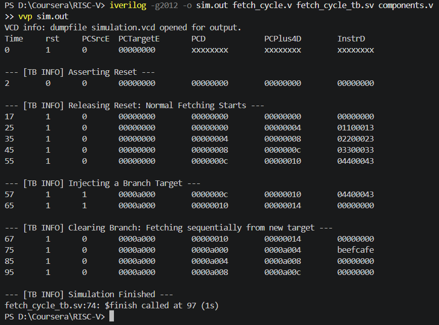
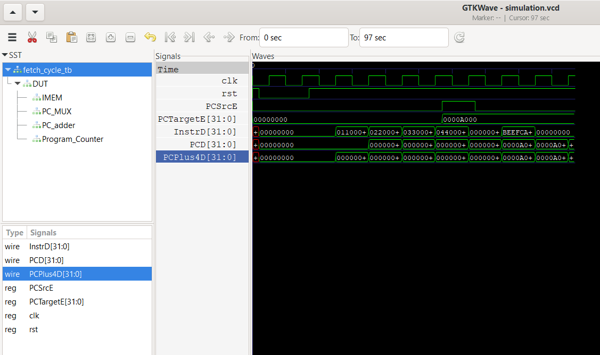

- Asynchronous reset forces `PCD`, `PCPlus4D`, and `InstrD` to `0x00000000` regardless of the clock edge
- PC increments by 4 bytes/cycle; Instruction Memory serves matching machine code one cycle later at the `IF/ID` boundary
- Branch injection (`PCSrcE = 1`, target `0x0000A000`) confirms the PC mux instantly overrides the sequential adder and resumes sequential fetch once cleared

</details>

<details>
<summary><b>Decode Stage</b></summary>

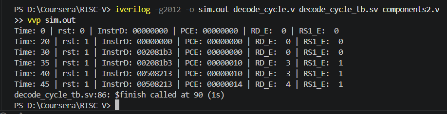
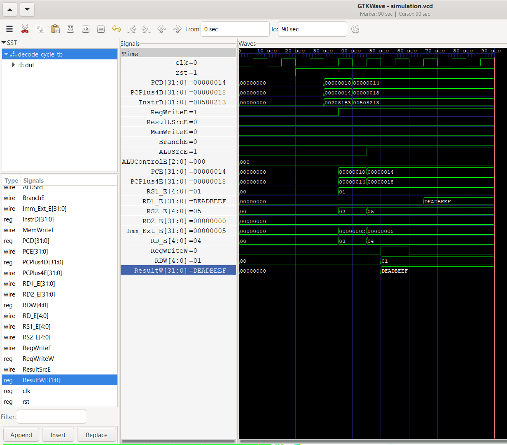

- Reset forces `PCE`, `RD_E`, `RS1_E` to zero, preventing undefined data from reaching Execute
- Confirms the required 1-cycle `ID/EX` latch delay for both operand addresses and the sign-extended immediate
- Validates the Register File's write-back feedback loop: a value driven onto `ResultW` with `RegWriteW` high is immediately readable from the same register on `RD1_E`

</details>

<details>
<summary><b>Execute Stage</b></summary>

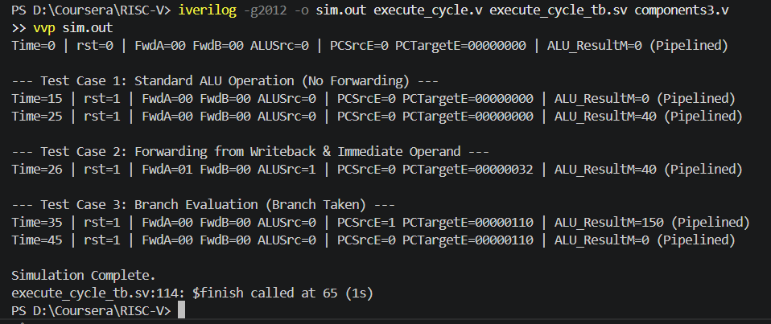
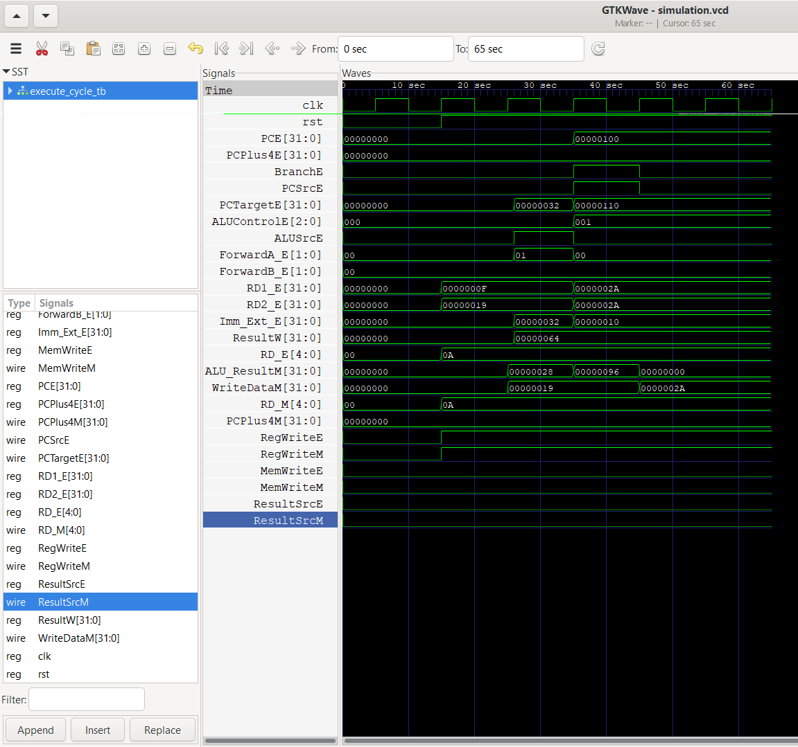

- **Test 1 — standard operation:** confirms the 1-cycle `EX/MEM` latch delay with no forwarding active
- **Test 2 — forwarding:** `FwdA = 01` demonstrates a detected RAW hazard being resolved by routing a Writeback-stage result directly into the ALU, alongside a sign-extended immediate on `SrcBE`
- **Test 3 — branch evaluation:** computes target `0x00000110` and correctly asserts `PCSrcE`, driving the Fetch-stage redirect

</details>

<details>
<summary><b>Memory Stage</b></summary>

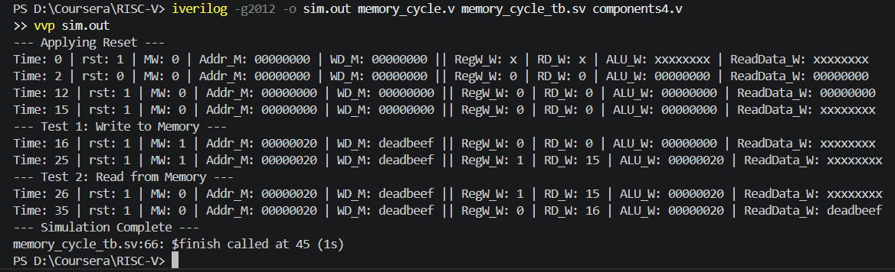
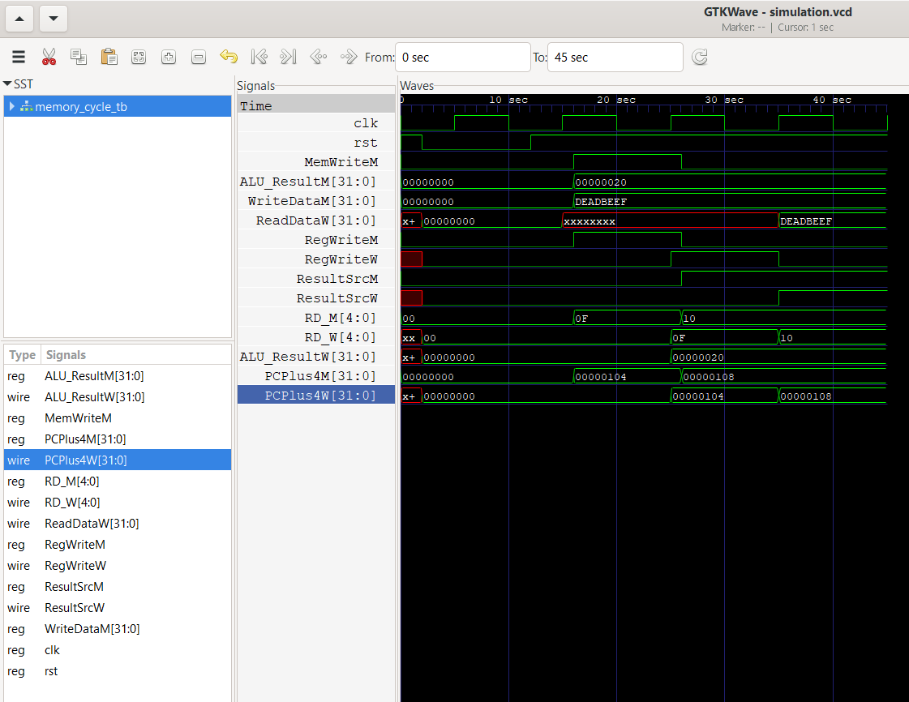

- Reset flushes pipeline registers to a known zero state
- Store test: `MemWriteM` high commits `0xDEADBEEF` to address `0x00000020`
- Load test: the same address is read back one cycle later through the `MEM/WB` boundary, confirming correct pipeline latency

</details>

<details>
<summary><b>Writeback Stage</b></summary>

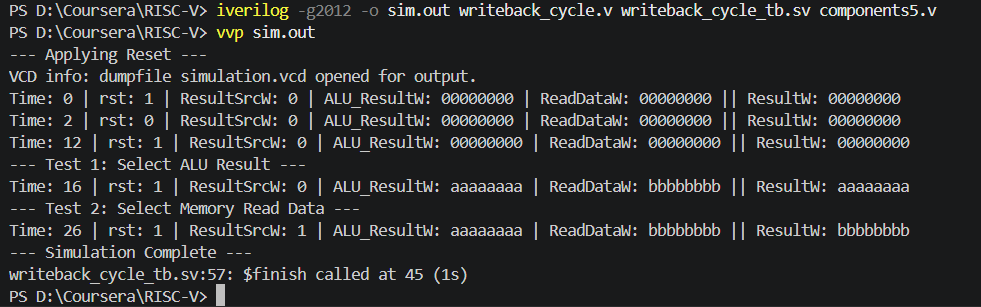
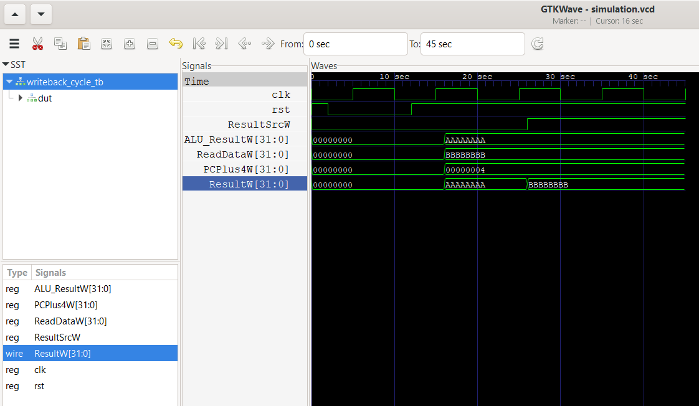

- Reset forces `ResultW` to a safe `0x00000000`
- `ResultSrcW` mux correctly isolates the ALU result (`00`) vs. memory read data (`01`) onto the final `ResultW` bus
- Confirms combinational (not clocked) mux behavior — the correct source appears the instant `ResultSrcW` changes

</details>

<details>
<summary><b>Hazard Unit</b></summary>

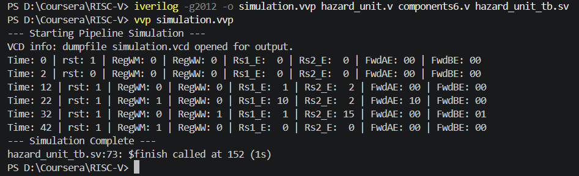
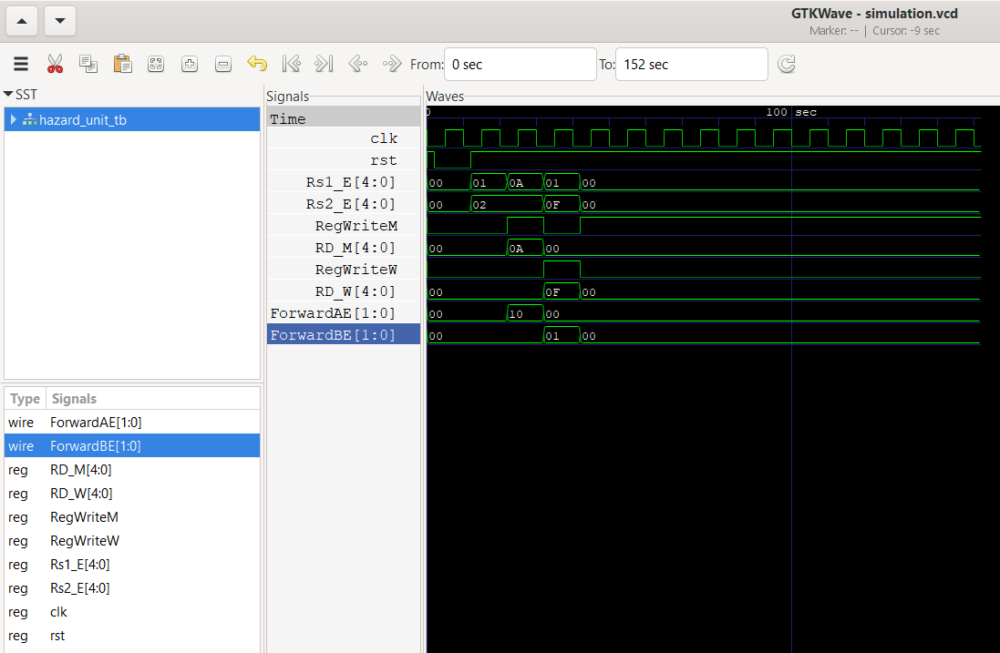

- No-hazard case: with no `RegWriteM`/`RegWriteW` active, both `ForwardAE`/`ForwardBE` correctly default to `00`
- `EX/MEM` hazard: matching destination/source register 10 correctly asserts `ForwardAE = 10`
- `MEM/WB` hazard: matching register 15 correctly asserts `ForwardBE = 01`
- **Zero-register edge case:** even with matching addresses, `RdM == 0` correctly blocks forwarding — `x0` can never be overwritten or forwarded

</details>

<details>
<summary><b>Top-Level Pipeline Integration</b></summary>


- `memfile.hex` loads two I-type instructions that write `5` and `3` into registers, followed by an `add` that depends on both
- When the `add` reaches Execute, the Hazard Unit asserts `FwdAE/BE = 01/10`, routing `5` from `MEM/WB` and `3` from `EX/MEM` directly into the ALU
- The ALU correctly computes `0x00000008` and it is safely committed to the register file — **no pipeline stall required**

</details>

---

## Author

**Dhruv Deshpande**
[github.com/dhruv-deshpande](https://github.com/dhruv-deshpande) · dhruvd2405@gmail.com
